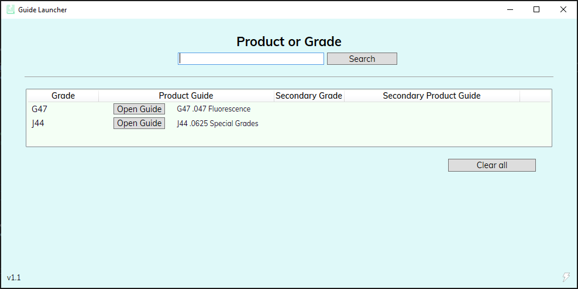

# GuideLauncher1-1
Professional project using M-V-VM architecture, and a WPF GUI with data binding.

#Notes
This project is incomplete, but uploaded as an example of code structure. 
Compiled files and certain libraries have been removed.
Addresses and names have been changed for security.
